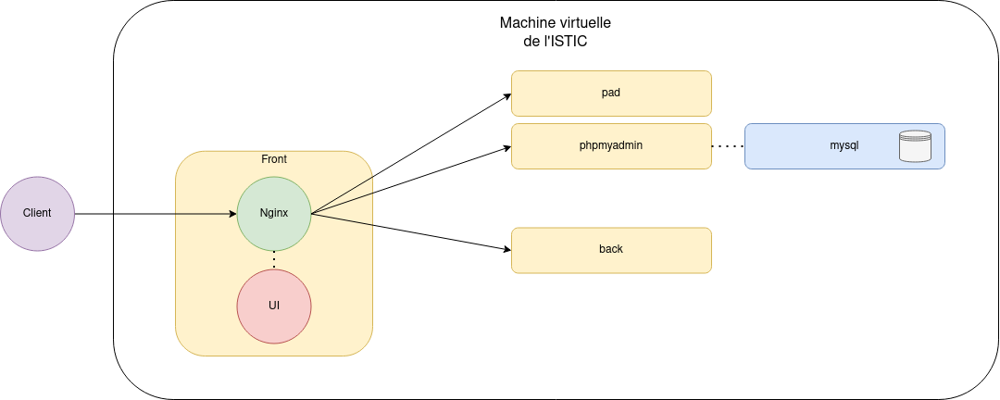
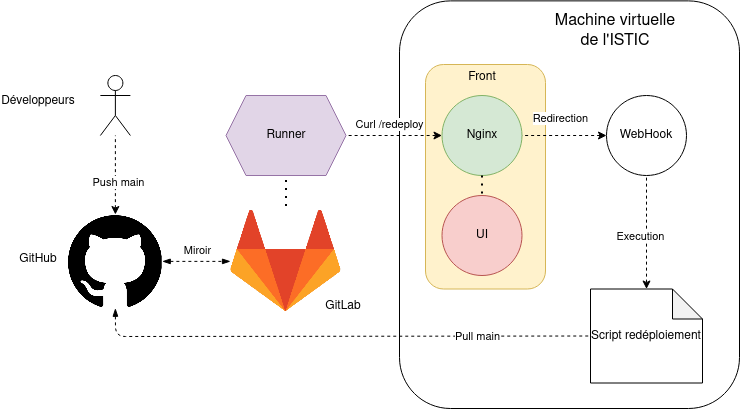
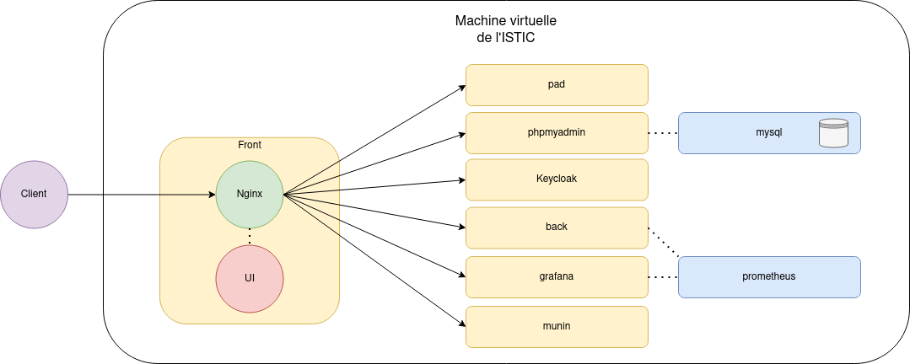

# TLC

## Projet

Notre application est disponible ici : [https://rillettes.diverse-team.fr](https://rillettes.diverse-team.fr/)

- [Tâche 0](#t-che-0)
- [Tâche 1](#t-che-1)
- [Tâches 2 et 3](#t-ches-2-et-3)
- [Tâche 4](#t-che-4)
- [Tâche 5](#t-che-5)
- [Tâche 6](#t-che-6)
- [Tâche 7](#t-che-7)
- [Tâche 8](#t-che-8)
- [Déploiement final](#d-ploiement-final)

### Tâche 0

Nous avons créé une machine virtuelle, son IP est **148.60.11.221**, et notre sous-domaine associé est [rillettes.diverse-team.fr](rillettes.diverse-team.fr).

Les ports **80** et **443** sont ouverts pour la suite du projet.

### Tâche 1

L’application entière est séparée en différents containers docker, nous utilisons docker-compose pour les faire tourner tous ensemble correctement.

Nous avons créé deux **Dockerfiles** :

- Pour le backend, `./api/Dockerfile`

- Pour le frontend, `./front/Dockerfile`

À la racine, le fichier `docker-compose.yaml` décrit les différentes images docker utilisées pour le fonctionnement de l’application et utilise nos deux **Dockerfile** (frontend et backend) et des images venant de **Docker Hub**.

On notera qu’il y a eu des problèmes de lancement de l’application au début car les tests du backend ne passaient pas. Pour résoudre ce problème, nous passons les tests lors du build.

```bash
./mvnw package -Dmaven.test.skip=true
```


### Tâches 2 et 3

Dans notre Dockerfile du frontend, nous avons utilisé l’image `bunkerity/bunkerized-nginx`, cette image contient un **Nginx** configurable. Pour la redirection vers les différents services de l’application (**reverse proxy**), il y a le fichier `./api/server-confs/api.conf` qui contient la configuration de redirection. L’accès à ce fichier de configuration et aux certificats est possible grâce à ces volumes :

```dockerfile
volumes:

 - ./api/server-confs:/server-confs:ro

 - ./certificates:/etc/letsencrypt
```

Cette image nous permet également de générer des configurations **Nginx** simplement en ajoutant des variables d’environnement spécifiques.

```dockerfile
environment:

 - SERVER_NAME=rillettes.diverse-team.fr pad.rillettes.diverse-team.fr myadmin.rillettes.diverse-team.fr prometheus.rillettes.diverse-team.fr grafana.rillettes.diverse-team.fr keycloack.rillettes.diverse-team.fr

 - AUTO_LETS_ENCRYPT=yes

 - REDIRECT_HTTP_TO_HTTPS=yes

 - HTTP2=no

 - FEATURE_POLICY=accelerom […] 'none'
```

(Détails sur le repo **GitHub** du projet : https://github.com/bunkerity/bunkerized-nginx)

Avec cette configuration, la génération des certificats **Let's Encrypt** se fait automatiquement et pour chacun des sous-domaines détaillés dans la variable d'environnement SERVER_NAME.

Plutôt que de push nos images de frontend et de backend sur le **Docker Hub**, nous utilisons le mot-clé `build:` dans le fichier `docker-compose.yaml` cela permet de préciser un **Dockerfile** à build plutôt qu’une image à télécharger.

Nous avons également mis en place un pare-feu sur notre VM avec **Uncomplicated FireWall**.

### Tâche 4

À cette étape, l’application est déployée de cette façon.



Chaque composant dans la VM est déployé dans un **container**. Ils sont tous regroupés dans le `docker-compose.yaml`.

### Tâche 5

Afin de mettre en place un système de déploiement continu, nous avons utilisé les **runners** de **GitLab**.

Notre repo étant sur **GitHub**, nous avons créé un repo miroir sur GitLab qui pull en permanence sur **GitHub**.

Nous avons également utilisé le package **WebHook** [GitHub - adnanh/webhook](https://github.com/adnanh/webhook).

Le listener de **webhooks** ne tourne pas dans un container, mais directement sur la machine.

Lors d’un push sur **GitHub**, le repo **GitLab** pull,  et exécute automatiquement les instructions fournies dans `.gitlab-ci.yml`.

Nous avons indiqué dans ce fichier un curl sur l’adresse https://rillettes.diverse-team.fr/redeploy.

Lorsque le reverse proxy reçoit une requête sur cette adresse, il la retransmet sur au listener de **webhook**.

Le **webhook** exécute ensuite le script adapté, qui arrête les containers, pull sur **GitHub**, rebuild, et relance les containers.



Deux points à noter :

- Ce système manque grandement de sécurité, n’importe qui peut lancer le déploiement en accédant à l’adresse. Il faudrait ajouter un système pour vérifier que la requête provient de **GitLab**, nous ne l’avons pas implémenté par manque de temps.

- De par le même problème de manque de temps, nous n’avons pas étendu les possibilités du déploiement continu, aucun test n’est exécuté avant de déployer.

### Tâche 6

Pour mettre en place une chaîne de monitoring, nous avons ajouté **Prometheus** et **Grafana** à notre `docker-compose.yaml`. 

Leurs adresses respectives sont [prometheus.rillettes.diverse-team.fr](http://prometheus.rillettes.diverse-team.fr) et [grafana.rillettes.diverse-team.fr](http://grafana.rillettes.diverse-team.fr).

De la même façon que précédemment, les certificats pour **Grafana** sont générés automatiquement à l’aide de l’option Auto Let’s Encrypt de **Bunkerized Nginx**. C’est d’ailleurs vrai pour chacun des sous-domaines de notre application.

Le lien entre **Prometheus** et **Grafana** est établi dans le fichier de configuration `grafana/provisioning/datasources/datasource.yaml`.

Similairement, le lien entre **Prometheus** et notre backend est établi dans un autre fichier de configuration `prometheus.yml`.

Nous avons également ajouté **Munin** au docker-compose pour la surveillance de la machine virtuelle (adresse [munin.rillettes.diverse-team.fr](http://munin.rillettes.diverse-team.fr))

### Tâche 7

Nous avons essayé d’utiliser **Kubernetes** pour déployer notre application, en nous basant sur **Microk8s**.

Nous avons push les **DockerFiles** du backend et du frontend sur le repository local pour qu’ils puissent être récupérés par **Kubernetes**.

Nous avons utilisé **Kompose** pour convertir notre docker-compose.yaml en fichiers pouvant être interprétés par **Kubernetes**.

 La commande utilisée pour la conversion est:

```bash
 kompose convert
```

On peut ensuite appliquer ces fichiers avec la commande :

```bash
microk8s kubectl apply -f k8s/
```

Les fichiers convertis ne sont cependant pas directement fonctionnels, il faut les modifier manuellement.

Nous avons rencontré des difficultés durant cette tâche, une des principales étant la gestion du proxy.

Par exemple, **microk8s** étant déployé sur la VM, on ne peut pas accéder directement au dashboard. Après de longues recherches, nous avons réussi à y accéder en le démarrant avec la commande :

```bash
microk8s kubectl port-forward -n kube-system service/kubernetes-dashboard 443:443 --address 0.0.0.0
```

En utilisant cette technique, on peut par exemple déployer notre service phpMyAdmin avec :

```bash
sudo microk8s kubectl port-forward service/myadmin 80:8082 --address 0.0.0.0
```

Nous n’avons cependant pas réussi à déployer l'entièreté de l’application de cette façon.

### Tâche 8

La tâche précédente, sur **microk8s** ne fonctionnant pas complètement, nous n’avons pas pu mettre en place **Keycloak** avec Ambassador.

Nous avons ajouté **Keycloak** dans le docker-compose.yaml (avec [https://hub.docker.com/r/jboss/keycloak/](https://hub.docker.com/r/jboss/keycloak/)), avec sa propre base de données MySQL.

En ajoutant le routage nécessaire pour le proxy, et en réservant un sous-domaine, nous pouvons accéder au dashboard **Keycloak** à l'adresse [keycloack.rillettes.diverse-team.fr](http://keycloack.rillettes.diverse-team.fr).

Nous sommes cependant confrontés à un problème, que nous n’avons pas encore résolu malgré le temps passé à essayer. Lors du paramétrage de Keycloak dans son interface, nous rentrons dans une boucle de redirection dont il est impossible de sortir.

### Déploiement final

Le déploiement **final** sur la machine virtuelle :


